# ChefHive

**Traditional cooks for every occasion.**
ChefHive lets families book cooks who specialise in regional Indian food, from Kerala sadhya to Rajasthani dal baati, for poojas, festivals and family functions. The food is cooked fresh in the family's own kitchen.

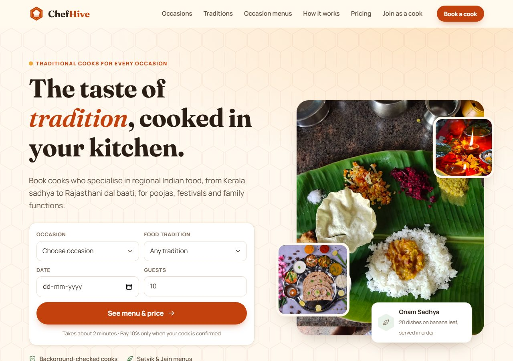

**Stack:** React (Vite) · Node.js + Express · MySQL 8

> **Status:** the website and API work end to end. Prices, menus and photos are still sample content, and there are no logins or online payments yet (see [Roadmap](#15-roadmap)).

## Contents

1. [About the project](#1-about-the-project)
2. [Market research](#2-market-research)
3. [Screenshots](#3-screenshots)
4. [Features](#4-features)
5. [Architecture](#5-architecture)
6. [Getting started](#6-getting-started)
7. [Project structure](#7-project-structure)
8. [API reference](#8-api-reference)
9. [Database](#9-database)
10. [How booking and pricing work](#10-how-booking-and-pricing-work)
11. [Security](#11-security)
12. [Quality: accessibility, SEO, responsiveness](#12-quality-accessibility-seo-responsiveness)
13. [Deployment](#13-deployment)
14. [Before launch checklist](#14-before-launch-checklist)
15. [Roadmap](#15-roadmap)
16. [Credits and licence](#16-credits-and-licence)

---

## 1. About the project

### The problem
Occasions in Indian homes come with food rules:
- A sadhya has 20+ dishes served on a banana leaf in a set order.
- A pooja or griha pravesh lunch often can't use onion or garlic.
- Shraddh and fasting days have prescribed dishes.
- Every family has "the way we make it".

Cook-booking apps today focus on daily cooks, party chefs and catering. None of them lets you book a cook who specialises in *your* regional tradition for an occasion.

### Our idea (USP)
ChefHive books **cooks by tradition**, occasionally, for the days that matter:

- **Regional specialists.** Cooks are listed by the cuisines they grew up cooking (Chettinad, Udupi, Bengali, Gujarati…), not just "North Indian" or "South Indian".
- **Ritual-ready.** Satvik, Jain, no-onion-garlic, fasting food and naivedyam.
- **Family recipes.** The cook follows how *your* family makes it.
- **Right-sized.** From 6 guests at home to 150 at a function, with helpers and serving staff.

### Who it's for
| User | What they do on ChefHive |
| --- | --- |
| **Hosts (customers)** | Pick the occasion, tradition, menu, date and guest count, see the price and request a cook |
| **Traditional cooks (partners)** | Apply with their traditions, signature dishes and the occasions they've cooked for |
| **ChefHive team** | Read booking requests and cook applications through the admin API, then confirm by phone |

## 2. Market research

| Platform | What it offers |
| --- | --- |
| **ChefKart** | "Chefit": a chef arrives within 60 minutes and cooks up to 4 dishes for up to 8 people (app-based) |
| **BookMyChef** | Private chefs, catering, bartending and monthly chef subscriptions. Chefs are graded Junior / Senior / Pro, with broad cuisines |
| **COOX** | Cooks for events, parties or daily meals |
| **Cookzy** | Home cooks, filtered by experience and cuisine |
| **Take a Chef** | Personalised menus for events, created with a chef |
| **Broomees** | Cook services in Bangalore |

**Gap found:** none of them leads with *traditional, regional food specialists booked for occasions*. That is ChefHive's unique selling point. BookMyChef was used as the reference for page structure and booking flow.

## 3. Screenshots

### Home page
| | |
| --- | --- |
| 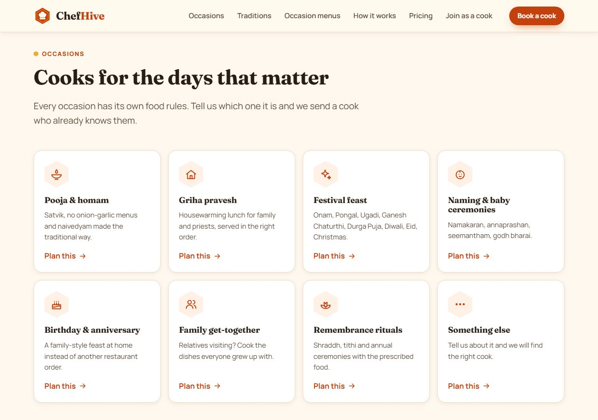 **Occasions:** 8 occasion types, each links into booking | 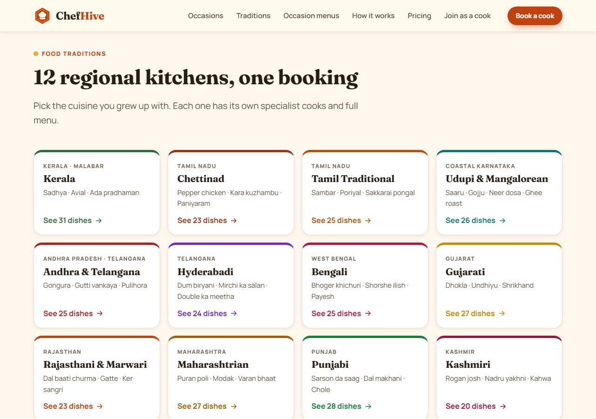 **Food traditions:** 12 regional kitchens |
| 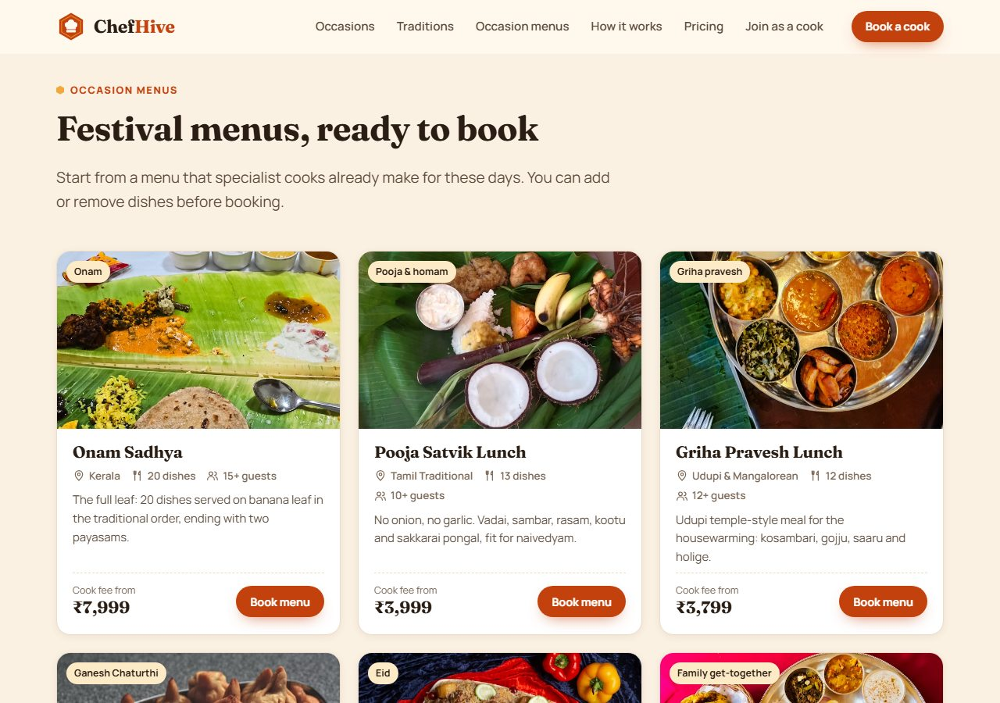 **Occasion menus:** 9 ready-made festival menus with starting price | 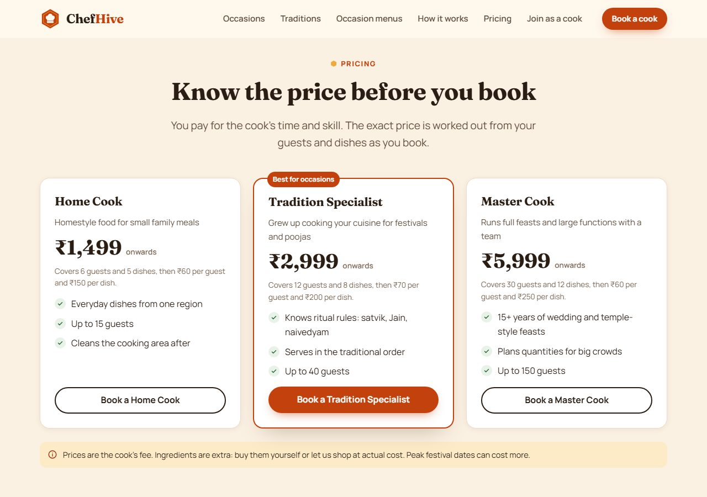 **Pricing:** 3 cook levels, upfront rates |

### Booking flow
| | |
| --- | --- |
| 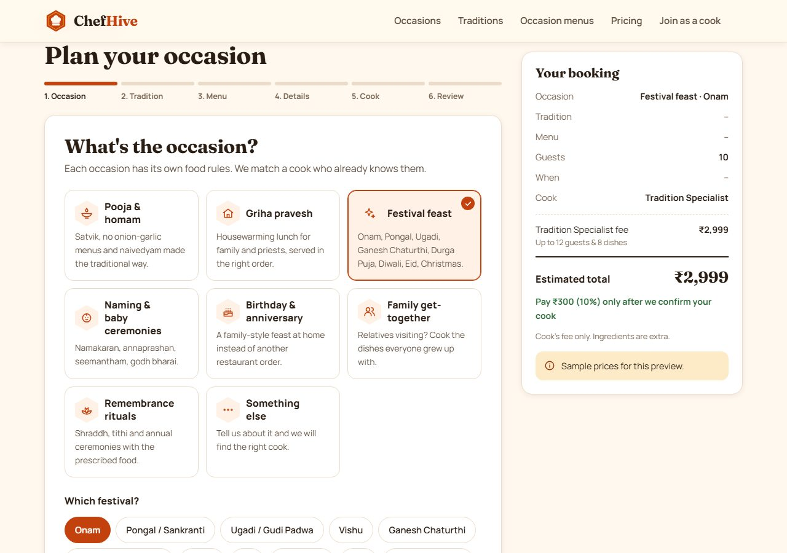 **Step 1: Occasion** (+ which festival) | 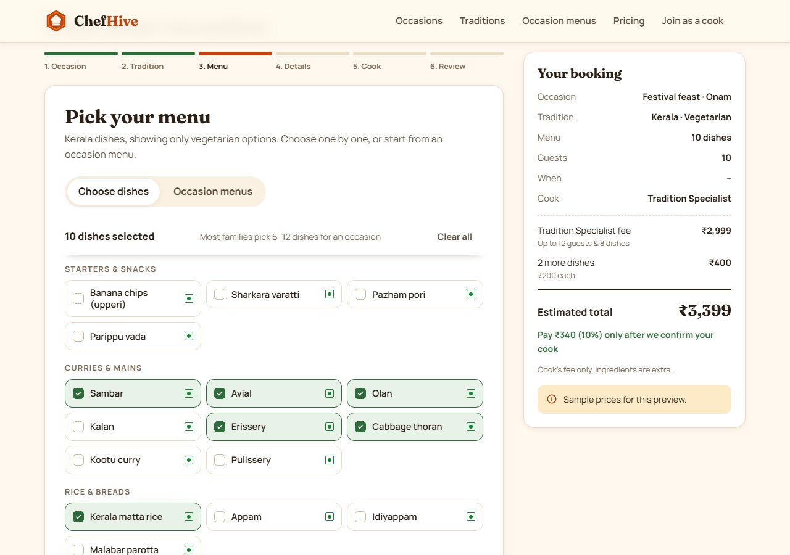 **Step 3: Menu:** pick dishes, veg / non-veg marks, live price |
| 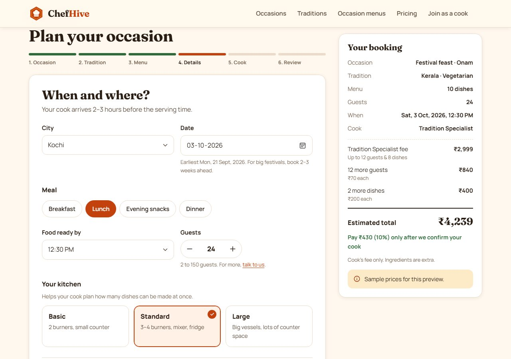 **Step 4: When and where:** city, date, meal, time, guests, kitchen | 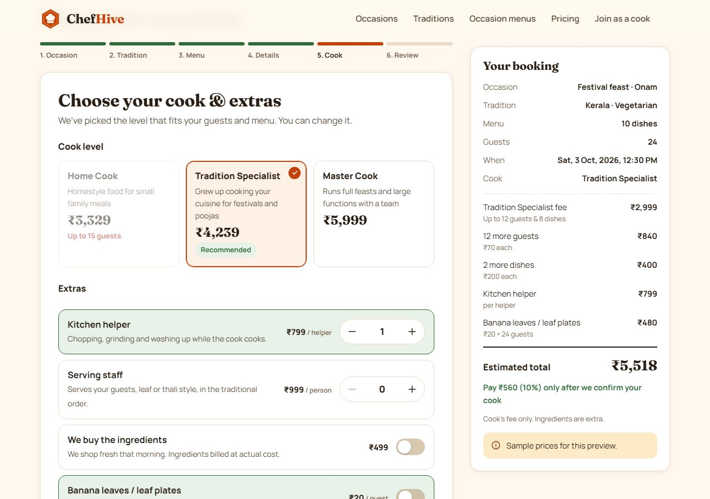 **Step 5: Cook and extras:** recommended level, helpers, add-ons |
| 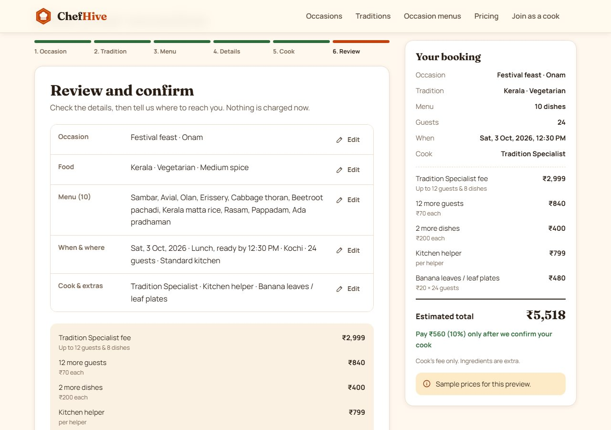 **Step 6: Review:** everything editable, full price breakdown, contact details | 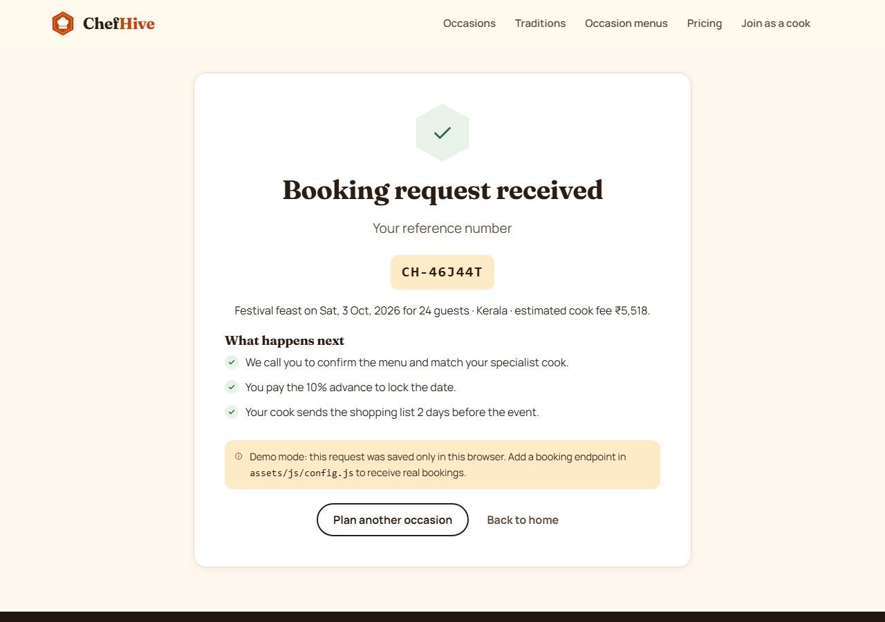 **Confirmation:** reference number and next steps |

### Join as a cook
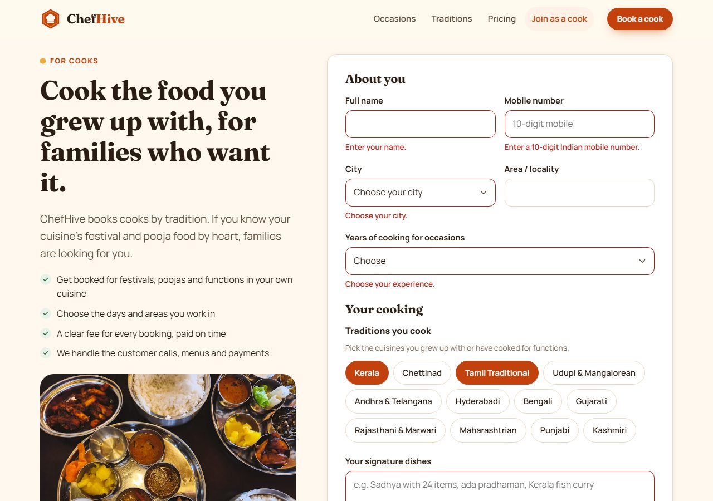

### On phones
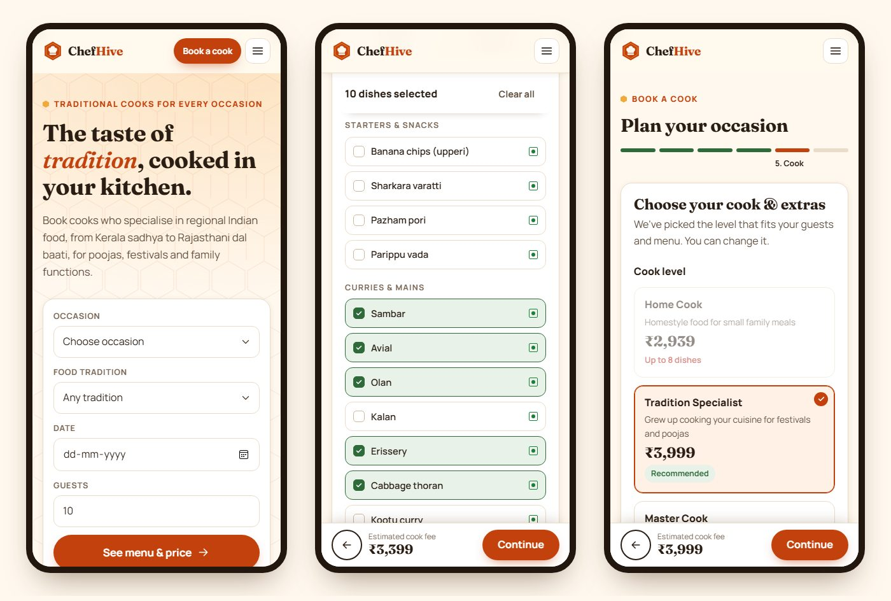

## 4. Features

**Customer website (React)**
- Quick booking on the home page. Every card (occasion, tradition, menu, cook level) opens the booking flow with that choice already filled in, through URL parameters such as `/book?package=onam-sadhya`.
- **8 occasions**, **12 food traditions**, **304 dishes** and **9 occasion menus**, all served from MySQL.
- **Food rules:** vegetarian, non-vegetarian, satvik (no onion or garlic) and Jain (no root vegetables). Dishes that don't fit are hidden automatically.
- **Live price estimate** that updates as you choose, with a line-by-line breakdown and the advance amount.
- **Automatic cook level:** the right level is chosen from guests and dishes; levels that can't handle the booking are disabled.
- **Helper suggestion** for larger groups (one kitchen helper per 20 guests).
- **Draft saved in the browser,** so a refresh doesn't lose progress, with a "Start over" option.
- Validation with clear messages, and a confirmation screen with a reference number (`CH-XXXXXX`).

**Cook sign-up**
- Application form covering city, experience, traditions, signature dishes, occasions, food rules, group size, helpers and languages. Returns a `CK-XXXXXX` reference.

**API (Express + MySQL)**
- One catalogue endpoint that the whole site renders from.
- Bookings and cook applications are validated and stored, with **prices recalculated on the server**.
- Admin endpoints to list bookings and applications, update a booking's status and read simple statistics.

## 5. Architecture

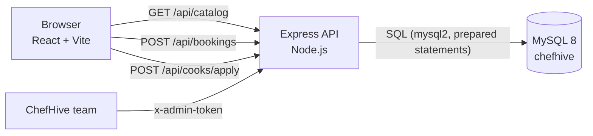

- **client/** is a single-page React app. It renders entirely from the catalogue the API returns, so adding a dish or changing a price needs no front-end change.
- **server/** is an Express API. It validates every request, recalculates prices and writes to MySQL inside transactions.
- **MySQL** holds both the catalogue (occasions, traditions, dishes, menus, prices) and the records (bookings, booking dishes, booking add-ons, cook applications).

**Why this split:** the price shown in the browser is only an estimate for display. The server recalculates it from the database before saving, so a customer cannot change what they are charged by editing the page.

## 6. Getting started

**You need:** Node.js 18 or newer, and MySQL 8 running locally.

```bash
npm run install:all
```

1. **Start MySQL.** On Windows, in an Administrator terminal: `net start MYSQL80`.
2. **Set your database details.** Copy `server/.env.example` to `server/.env` and fill in `DB_USER` and `DB_PASSWORD`.
3. **Create the tables:**
   ```bash
   npm run db:setup
   ```
4. **Load the catalogue** (12 traditions, 304 dishes, 9 occasion menus, prices, cities):
   ```bash
   npm run seed
   ```
5. **Run both servers:**
   ```bash
   npm run dev
   ```
   The website is at http://localhost:5173 and the API at http://localhost:4000. Vite passes `/api` calls through to the API, so the browser only ever sees one origin.

Useful single commands: `npm run dev:api`, `npm run dev:web`, `npm run build`.

## 7. Project structure

```
chefhive/
├── client/                      React website (Vite)
│   ├── index.html
│   ├── vite.config.js           Dev server + /api proxy
│   └── src/
│       ├── main.jsx, App.jsx    Entry point and routes
│       ├── api.js               Calls to the API
│       ├── config.js            Phone, WhatsApp and email shown on the site
│       ├── context/
│       │   └── CatalogContext.jsx   Loads /api/catalog once and shares it
│       ├── lib/
│       │   ├── format.js        Money, dates, image URLs
│       │   └── pricing.js       The live estimate (server repeats this calculation)
│       ├── components/
│       │   ├── Icon.jsx, Layout.jsx
│       │   └── booking/         Bits.jsx, Steps.jsx, Panels.jsx
│       ├── pages/               Home.jsx, Book.jsx, Partner.jsx
│       └── styles/              base.css, home.css, booking.css
├── server/                      Express API
│   ├── src/
│   │   ├── index.js             App setup, health check, error handling
│   │   ├── db.js                MySQL pool, transaction helper
│   │   ├── catalog.js           Loads and caches the catalogue
│   │   ├── pricing.js           Price calculation (the authoritative one)
│   │   ├── validate.js          Request validation
│   │   └── routes/              catalog.js, bookings.js, cooks.js, admin.js
│   ├── db/
│   │   ├── schema.sql           Tables
│   │   ├── setup.js             Creates the database from schema.sql
│   │   ├── seed.js              Fills the catalogue tables
│   │   └── seed-data.json       The catalogue content
│   └── .env.example
├── docs/screenshots/            Images used in this README
└── package.json                 Scripts that drive both folders
```

## 8. API reference

Base URL in development: `http://localhost:4000`

| Method | Path | Purpose |
| --- | --- | --- |
| `GET` | `/api/health` | Server and database status |
| `GET` | `/api/catalog` | Occasions, festivals, traditions with dishes, occasion menus, cook levels, add-ons, cities and settings |
| `POST` | `/api/bookings` | Create a booking request. Returns the reference and the server's price |
| `GET` | `/api/bookings/:ref` | Status of one booking (no personal details) |
| `POST` | `/api/cooks/apply` | Cook application |
| `GET` | `/api/admin/bookings` | List bookings (`?status=new&limit=50`) |
| `PATCH` | `/api/admin/bookings/:ref` | Change status: `new`, `confirmed`, `cancelled`, `completed` |
| `GET` | `/api/admin/cooks` | List cook applications |
| `GET` | `/api/admin/stats` | Counts by status, upcoming bookings, new applications |

Admin endpoints need the header `x-admin-token: <ADMIN_TOKEN from server/.env>`.

**Create a booking**

```http
POST /api/bookings
Content-Type: application/json

{
  "occasionId": "festival", "festival": "Onam",
  "traditionId": "kerala", "foodStyle": "veg", "spice": "medium",
  "packageId": "onam-sadhya",
  "dishes": ["kl-sambar", "kl-avial", "kl-olan", "kl-matta", "kl-adapradhaman"],
  "city": "Kochi", "eventDate": "2026-10-03", "meal": "lunch", "readyBy": "12:30",
  "guests": 24, "kitchen": "standard", "levelId": "specialist",
  "addons": { "helper": 1, "leaves": true },
  "name": "Anjali Menon", "phone": "9876543210", "email": "",
  "address": "Panampilly Nagar, Kochi", "pincode": "682036",
  "notes": "Please serve on banana leaf in the traditional order.",
  "consent": true
}
```

```json
201 Created
{
  "ref": "CH-46J44T",
  "estimate": {
    "lines": [
      { "key": "cook",   "label": "Tradition Specialist fee", "detail": "Up to 12 guests & 8 dishes", "amount": 2999 },
      { "key": "guests", "label": "12 more guests",           "detail": "₹70 each",  "amount": 840 },
      { "key": "addon:helper", "label": "Kitchen helper",     "detail": "per helper", "amount": 799 },
      { "key": "addon:leaves", "label": "Banana leaves / leaf plates", "detail": "₹20 × 24 guests", "amount": 480 }
    ],
    "cookFee": 3839, "addonsTotal": 1279, "total": 5118, "advance": 520
  },
  "level": { "id": "specialist", "name": "Tradition Specialist" }
}
```

A failed check returns `400` with one message per field, which the React form shows next to the matching input:

```json
{ "error": "validation_failed", "errors": { "phone": "Enter a 10-digit Indian mobile number." } }
```

## 9. Database

`chefhive` has 19 tables in two groups.

**Catalogue** (rebuilt by `npm run seed`): `settings`, `cities`, `occasions`, `festivals`, `food_styles`, `spice_levels`, `meals`, `kitchens`, `cook_levels`, `addons`, `traditions`, `courses`, `dishes`, `packages`, `package_dishes`.

**Records** (never touched by the seeder): `bookings`, `booking_dishes`, `booking_addons`, `cook_applications`.

Points worth knowing:
- `dishes` carries the three flags the food rules use: `is_nonveg`, `needs_onion_garlic` and `has_root_veg`.
- `booking_dishes` and `booking_addons` store the **name and price as they were at the time**, so an old booking still reads correctly after a dish is renamed or a price changes.
- Foreign keys link bookings to occasions, traditions and cook levels, so a booking can never point at something that doesn't exist.
- `bookings.ref` and `cook_applications.ref` are unique. References avoid the letters O, I and the digits 0 and 1, so they are easy to read out on a phone call.

Useful queries:

```sql
-- This week's confirmed bookings
SELECT ref, event_date, city, guests, total FROM bookings
WHERE status = 'confirmed' AND event_date BETWEEN CURDATE() AND CURDATE() + INTERVAL 7 DAY
ORDER BY event_date;

-- Most requested traditions
SELECT t.name, COUNT(*) AS bookings FROM bookings b
JOIN traditions t ON t.id = b.tradition_id GROUP BY t.name ORDER BY bookings DESC;
```

## 10. How booking and pricing work

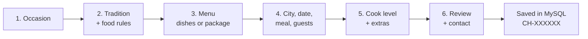

```
cook fee = level base price
         + (guests beyond the included guests) x per-guest rate
         + (dishes beyond the included dishes) x per-dish rate
total    = cook fee + add-ons
advance  = 10% of total, rounded up to the nearest ₹10
```
Ingredients are not included. The customer buys them, or adds the shopping service and pays the actual cost.

### Cook levels (sample prices, stored in `cook_levels`)
| Level | Base | Includes | Extra guest | Extra dish | Maximum |
| --- | --- | --- | --- | --- | --- |
| Home Cook | ₹1,499 | 6 guests, 5 dishes | ₹60 | ₹150 | 15 guests, 8 dishes |
| **Tradition Specialist** | ₹2,999 | 12 guests, 8 dishes | ₹70 | ₹200 | 40 guests, 16 dishes |
| Master Cook | ₹5,999 | 30 guests, 12 dishes | ₹60 | ₹250 | 150 guests, 28 dishes |

For poojas, griha pravesh, festivals, naming ceremonies and remembrance rituals, the Tradition Specialist is recommended even for small groups.

### Add-ons (stored in `addons`)
| Add-on | Price |
| --- | --- |
| Kitchen helper | ₹799 per helper (up to 4) |
| Serving staff | ₹999 per person (up to 6) |
| We buy the ingredients | ₹499 flat, plus ingredients at actual cost |
| Banana leaves / leaf plates | ₹20 per guest |
| After-meal cleaning | ₹699 flat |

### Worked example
Onam Sadhya (20 dishes) for 45 guests, with 2 kitchen helpers, 1 serving staff and banana leaves:

| Line | Amount |
| --- | --- |
| Master Cook fee (covers 30 guests and 12 dishes) | ₹5,999 |
| 15 more guests × ₹60 | ₹900 |
| 8 more dishes × ₹250 | ₹2,000 |
| Kitchen helper × 2 | ₹1,598 |
| Serving staff × 1 | ₹999 |
| Banana leaves × 45 guests | ₹900 |
| **Estimated total** | **₹12,396** |
| Advance to confirm (10%) | ₹1,240 |

## 11. Security

Already in place:
- **Prices are recalculated on the server** from the database. Anything sent from the browser is ignored.
- **Every field is validated on the server** (`server/src/validate.js`): ids must exist, dishes must belong to the chosen tradition and match the food rules, dates must be inside the booking window, and the cook level must fit the guests and dishes.
- **Prepared statements** (`mysql2`) everywhere, so values can't be injected into SQL.
- **Transactions** for a booking and its dishes and add-ons, so a half-written booking is never left behind.
- Admin endpoints need a token, CORS is limited to the configured site origin, and request bodies are capped at 100 KB.
- `.env` is gitignored; no credentials are in the repository.

Still to do before real customers use it:
- Rate limiting and a spam check on the public POST endpoints.
- HTTPS everywhere, and a strong `ADMIN_TOKEN` (replaced later by proper staff logins).
- Phone OTP verification, so a booking cannot be made with someone else's number.

## 12. Quality: accessibility, SEO, responsiveness

- Semantic landmarks and a skip link; options are real radio buttons and checkboxes styled as cards, so keyboard and screen readers work.
- Focus moves to each step's heading; errors use `role="alert"` and are tied to their fields.
- The menu tabs follow the WAI-ARIA tabs pattern, and `prefers-reduced-motion` is respected.
- Unique page titles, Open Graph tags and JSON-LD for the organisation.
- Tested at desktop (1280px) and phone widths (346px and 390px) with no horizontal scrolling. On phones a sticky bar keeps the price and the Continue button in reach.

Single-page apps render in the browser, so for search engines it is worth moving the marketing pages to Next.js or adding pre-rendering when SEO starts to matter.

## 13. Deployment

- **Website:** `npm run build` produces `client/dist`, which any static host serves (Netlify, Vercel, Cloudflare Pages, S3). Set `VITE_API_URL` to the API's public URL at build time.
- **API:** any Node host (Render, Railway, a VPS, AWS). Set the environment variables from `.env.example` and run `npm start` behind a process manager.
- **Database:** a managed MySQL 8 (PlanetScale, Aiven, AWS RDS, DigitalOcean) or MySQL on your own server. Run `npm run db:setup` and `npm run seed` once against it.
- Point `CLIENT_ORIGIN` at the website's domain so CORS allows it.

## 14. Before launch checklist

- [ ] Register the domain and point it at the host.
- [ ] Search the "ChefHive" trademark on IP India (class 43, food services).
- [ ] Set the real phone, WhatsApp and email in `client/src/config.js`.
- [ ] Replace the Unsplash photos with your own food and cook photos (image ids live in the `settings` and `packages` tables).
- [ ] Confirm real prices in `cook_levels` and `addons`.
- [ ] Set a strong `ADMIN_TOKEN` and add rate limiting.
- [ ] Make sure every promise is true from day one: "background-checked cooks", "taste-tested", "we call you within 2 working days", and the cities list.
- [ ] Add Privacy Policy, Terms and Cancellation Policy pages. The site collects phone numbers and addresses, so India's DPDP Act applies.
- [ ] Back up the database on a schedule.

## 15. Roadmap

| Phase | Scope |
| --- | --- |
| **1. Static website (done)** | Home page, booking with live price, cook sign-up |
| **2. React + Express + MySQL (done)** | Catalogue and bookings in the database, server-side validation and pricing, admin endpoints |
| **3. Accounts and payments** | Phone OTP login for customers and cooks, cook profiles and availability, assigning a cook to each booking, an admin dashboard in React, Razorpay for the advance, reviews, SMS and WhatsApp notifications |
| **4. Grow** | Mobile apps (React Native), more cities and traditions, reminders for repeat occasions such as yearly shraddh or festival dates |

## 16. Credits and licence

- Food photos: [Unsplash](https://unsplash.com) (Unsplash licence), placeholders until ChefHive has its own.
- Fonts: Fraunces and Manrope from Google Fonts (SIL Open Font License).
- Market research and naming: the ChefHive team, September 2026.
- The first static version is kept in git history under the tag `v1-static`.

No open-source licence has been chosen yet. All rights reserved by the ChefHive team.
